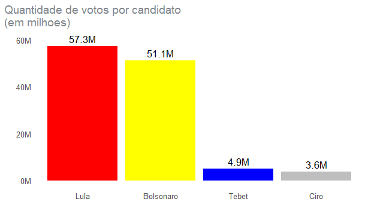

# Visualização de dados

<!-- badges: start -->
Motivado pelo trabalho final do curso de Visualização de dados do curso-r, resolvi mostrar graficamente alguns resultados da eleição presidencial 2022, fazendo um comparativo entre os candidados Luís Inácio Lula da Silva e Jair Messias Bolsonaro, além de apresentar gráficos comparativos com as eleições passadas. Os gráficos foram feitos no software Rstudio, utilizando o pacote ggplot2.

## Análise de dados

O gráfico 1 é um gráfico de barra que apresenta os candidatos que tiveram mais de 100 milhões de votos no primeiro turno da eleição presidencial. 

<!-- badges: end -->

The goal of Visualizacaodedados is to ...

