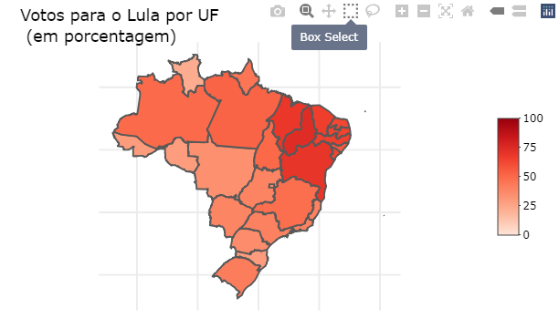
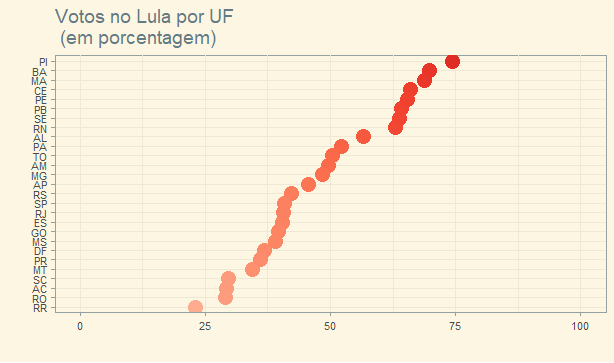
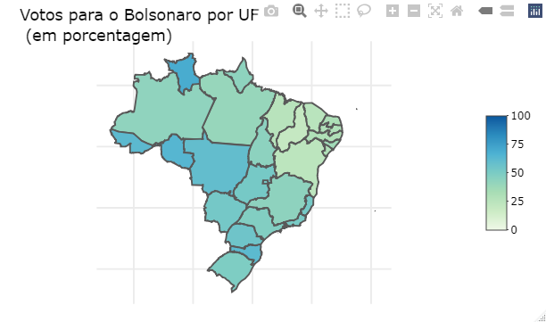
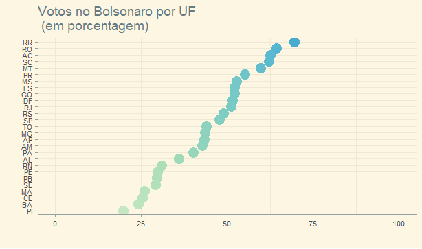
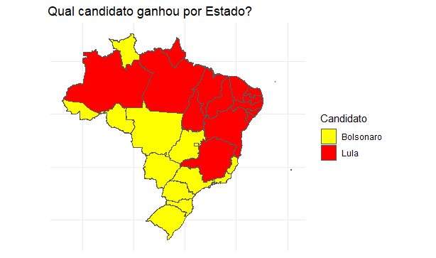
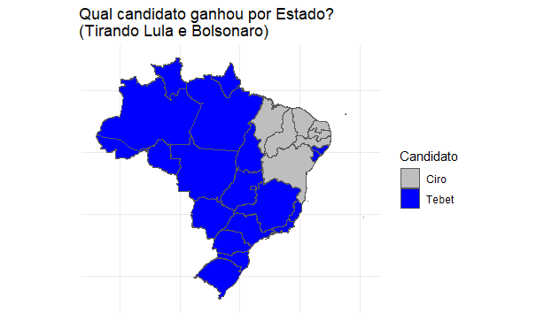
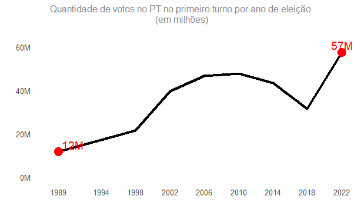
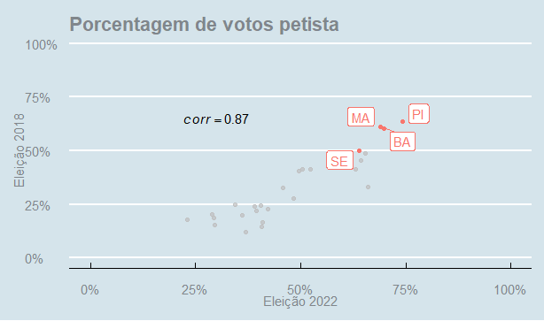
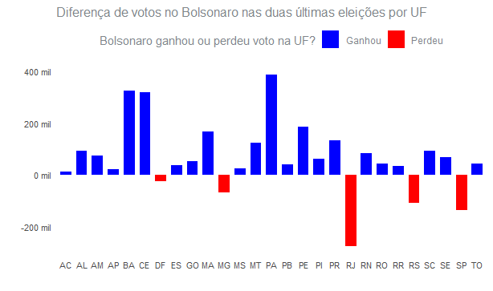
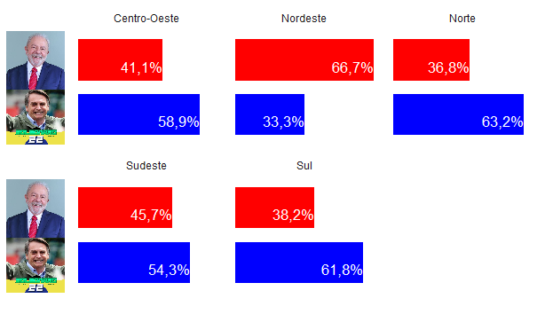

# Eleição Presidencial 2022

<!-- badges: start -->
Motivado pelo trabalho final do curso de Visualização de dados do [curso-r](https://curso-r.com/), resolvi mostrar graficamente alguns resultados da eleição presidencial 2022, fazendo um comparativo entre os candidados Luís Inácio Lula da Silva e Jair Messias Bolsonaro, além de apresentar gráficos que comparam os resultados dessa eleição com as eleições passadas para presidentes. Os gráficos foram feitos no software Rstudio, utilizando o pacote ggplot2, o script com a criação dos gráficos está no arquivo script_TRABFINAL.R . Além disso, vale destacar que os dados foram retirados do site do [TSE](https://www.tse.jus.br/) e do [wikipedia](https://pt.wikipedia.org/wiki/Wikip%C3%A9dia:P%C3%A1gina_principal). 

## Análise de dados 1° turno

O gráfico de barra apresenta os candidatos que tiveram mais de 100 milhões de votos no primeiro turno da eleição presidencial. O candidato do PT, Lula, foi que mais recebeu voto, seguido do ex-presidente Jair Messias Bolsonaro, na terceira posição veio a candidata do partido MDB, Simone Tebet, Ciro Gomes veio em quarto lugar. Todos esses candidados receberam mais de um milhão de votos. 

Os dois gráficos abaixos mostram como foi as porcentagens do candidato Luis Inácio Lula da Silva por UF. Pode-se observar que Lula alcançou as maiores porcentagem de voto na região Nordeste. Todos os estados nordestinos o candidato petista conquistou mais da maioria dos votos. Isso mostra a força que o candidato e o partido tem na região. 

 

Já os outros dois gráficos, mostram como foi o comportamentos dos votos do candidado Jair Messias Bolsonaro. O candidato do Partido Liberal teve mais de 50% de votos em 12 estados. 

 

Agora, vou mostrar qual candidato ganhou em cada Estado. E sem Bolsonaro e Lula? Qual foi a preferência de candidatos por Estado. Os dois gráficos abaixo mostram como foi o comportamento em cada estado, chama a atenção que na grande maioria dos estados a candidata Simone Tebet foi a preferida.

 
## Comparativo com eleições passadas

O gráfico de linha apresenta a evolução petista na quantidade de votos nas eleições presidenciais. Na primeira eleição petitas para presidente do Brasil, o PT, também com o Lula, atingiu a marca de 12 milhões de votos, enquanto na última eleição obteve 57 milhões de eleitores.

O gráfico de dispersão apresenta as porcentagens de votos petitas nas eleições de 2018 e 2022. Destaque-se que o PT teve mais de 50% dos votos em ambas eleições em 4 estados diferentes: Sergipe, Maranhão, Bahia e Piauí. 

O último gráfico de comparação com eleições antigas mostra os estados que Bolsonaro ganhou ou perdeu votos. Distrito Federal, Mina Gerais, Rio de Janeiro, Rio Grande doo Sul e São Paulo foram os 5 estados que o candidato que se candidatava a reeleição perdeu votos. 

## Análise de dados 2° turno

Agora vamos analisar os números do 2° turno da eleição. O primeiro gráfico mostra como foi a porcentagem de votos em cada região do Brasil. Observa-se que o presidente eleito, Luis Inácio Lula da Silva, venceu apenas na região do Nordeste.

O segundo gráfico mostra que a diferença em porcentagem dos votos entres os dois candidatos foi menos de 1%. Enquanto Bolsonaro antigiu 49,1% dos votos válidos, o candidato Lula se elegeu com 50,9%.

<!-- badges: end -->

